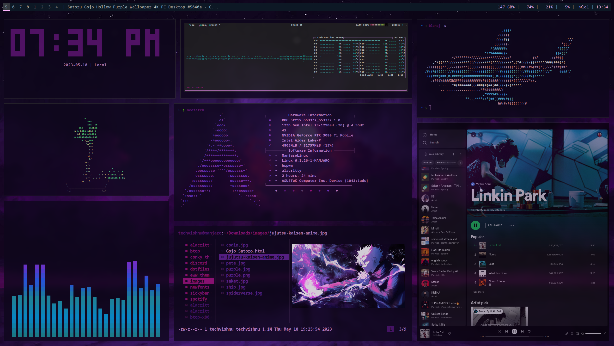

  
  

<h1 align="center">
  LINUX DOTFILES 
  
   
</h1>
### 🐜 ScreenShot

<b>Load More</b> (Click to expend)  

- **Other Rices** • [Reddit](https://www.reddit.com/user/OnlyMemer420)🌿 I have pinned my Beginner rices on my reddit profile !

